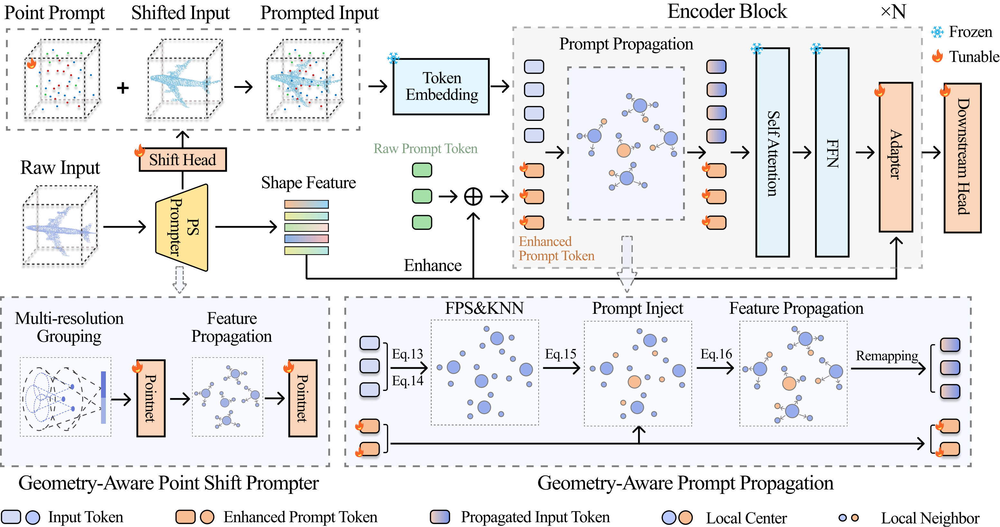
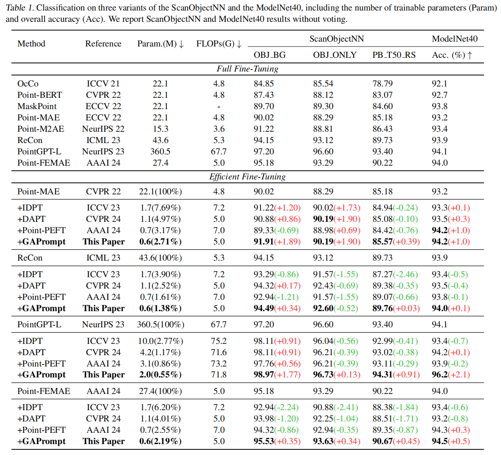

# GAPrompt: Geometry-Aware Point Cloud Prompt for 3D Vision Model
<div align="center">
    Zixiang Ai<sup>1</sup>&emsp; Zichen Liu<sup>1</sup>&emsp; Yuanhang Lei<sup>2</sup>&emsp; Zhenyu Cui<sup>1</sup>&emsp; Xu Zou<sup>3</sup>&emsp; Jiahuan Zhou<sup>†</sup><sup>1</sup> <br>
    <sup>1</sup>Wangxuan Institute of Computer Technology, Peking University&emsp; <br>
    <sup>2</sup>State Key Laboratory of CAD&CG, Zhejiang University&emsp; 
    <sup>3</sup>School of Artificial Intelligence and Automation, Huazhong University of Science and Technology
</div>

<div align="center">
Official implementation of 'GAPrompt: Geometry-Aware Point Cloud Prompt for 3D Vision Model'.


The paper has been accepted by **ICML 2025**.
</div>


<p align="center"></p>


Pre-trained 3D vision models have gained significant attention for their promising performance on point cloud data. However, fully fine-tuning these models for downstream tasks is computationally expensive and storage-intensive. Existing parameter-efficient fine-tuning (PEFT) approaches, which focus primarily on input token prompting, struggle to achieve competitive performance due to their limited ability to capture the geometric information inherent in point clouds. 

To address this challenge, we propose a novel Geometry-Aware Point Cloud Prompt (GAPrompt) that leverages geometric cues to enhance the adaptability of 3D vision models. First, we introduce a Point Prompt that serves as an auxiliary input alongside the original point cloud, explicitly guiding the model to capture fine-grained geometric details. Additionally, we present a Point Shift Prompter designed to extract global shape information from the point cloud, enabling instance-specific geometric adjustments at the input level. Moreover, our proposed Prompt Propagation mechanism incorporates the shape information into the model's feature extraction process, further strengthening its ability to capture essential geometric characteristics. Extensive experiments demonstrate that GAPrompt significantly outperforms state-of-the-art PEFT methods and achieves competitive results compared to full fine-tuning on various benchmarks, while utilizing only 2.19\% of trainable parameters.

## Main Results

<p align="center"></p>


## Ckpt Release
To do.
<!-- 
Real-world shape classification on the PB-T50-RS split of ScanObjectNN:
| Method | Acc.| Logs |
| :-----: |:-----:| :-----:|
| Point-M2AE-aug |88.2% | [scan_m2ae.log](https://drive.google.com/file/d/1Dx8ucp_7_2GtSe60wq3jsbtn4xUKHqM8/view?usp=sharing) |
| Point-MAE-aug | 89.1% | [scan_mae.log](https://drive.google.com/file/d/1WF7mnKwqrluWTOuKHXPUfkBJ8cLUEONh/view?usp=sharing) | -->


## Environment
Create a conda environment and install basic dependencies:
```bash
git clone git@github.com:zhoujiahuan1991/ICML2025-GAPrompt.git
cd ICML2025-GAPrompt

# Not necessary
conda create -n gaprompt python=3.9
conda activate gaprompt

# Install the corresponding versions of Torch and TorchVision; other compatible versions are also acceptable.
pip install torch==1.13.1+cu116 torchvision==0.14.1+cu116 --extra-index-url https://download.pytorch.org/whl/cu116

pip install -r requirements.txt
```
Install GPU-related packages:
```bash
# Chamfer Distance and EMD
cd ./extensions/chamfer_dist
pip install .

cd ../emd
pip install .

# PointNet++
pip install "git+https://github.com/erikwijmans/Pointnet2_PyTorch.git#egg=pointnet2_ops&subdirectory=pointnet2_ops_lib"

# GPU kNN
pip install --upgrade https://github.com/unlimblue/KNN_CUDA/releases/download/0.2/KNN_CUDA-0.2-py3-none-any.whl
```
## Dataset
For pre-training and fine-tuning, please follow [DATASET.md](https://github.com/lulutang0608/Point-BERT/blob/master/DATASET.md) to install ModelNet40, ScanObjectNN, and ShapeNetPart datasets, referring to Point-BERT. Specially Put the unzip folder under `data/`.

The final directory structure should be:
```
│Point-PEFT/
├──cfgs/
├──datasets/
├──data/
│   ├──ModelNet/
│   ├──ScanObjectNN/
├──...
```

## Parameter-efficient Fine-tuning

To do.


## Citation
If you find our paper and code useful in your research, please consider giving a star and citation.
To do.
<!-- ```bash
@inproceedings{tang2024point,
  title={Point-PEFT: Parameter-efficient fine-tuning for 3D pre-trained models},
  author={Tang, Yiwen and Zhang, Ray and Guo, Zoey and Ma, Xianzheng and Zhao, Bin and Wang, Zhigang and Wang, Dong and Li, Xuelong},
  booktitle={Proceedings of the AAAI Conference on Artificial Intelligence},
  volume={38},
  number={6},
  pages={5171--5179},
  year={2024}
}
``` -->

## Acknowledgement
This repo benefits from [Point-BERT](https://github.com/lulutang0608/Point-BERT), [Point-MAE](https://github.com/Pang-Yatian/Point-MAE), [ReCon](https://github.com/qizekun/ReCon), [PointGPT](https://github.com/CGuangyan-BIT/PointGPT), [PointFEMAE](https://github.com/zyh16143998882/AAAI24-PointFEMAE), [IDPT](https://github.com/zyh16143998882/ICCV23-IDPT), [DAPT](https://github.com/LMD0311/DAPT), and [Point-PEFT](https://github.com/Ivan-Tang-3D/Point-PEFT). Thanks for their wonderful works.

